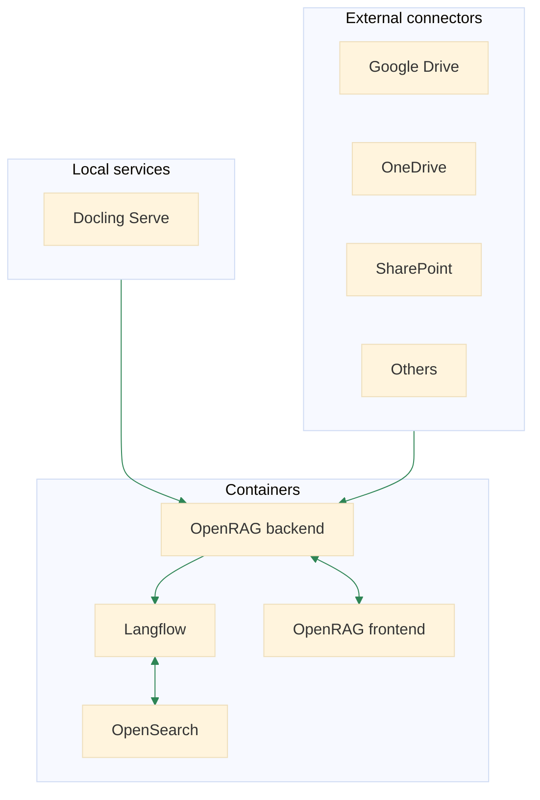

OpenRAG is an open-source package for building agentic RAG systems that integrates with a wide range of orchestration tools, databases, and LLM providers.

OpenRAG connects and amplifies three popular, proven open-source projects into one powerful platform:

* [Langflow](https://docs.langflow.org): Langflow is a versatile tool for building and deploying AI agents and MCP servers. It supports all major LLMs, popular vector databases, and a growing library of AI tools.

   OpenRAG uses several built-in flows, and it provides full access to all Langflow features through the embedded Langflow visual editor.

   By customizing the built-in flows or creating your own flows, every part of the OpenRAG stack interchangeable. You can modify any aspect of the flows from basic settings, like changing the language model, to replacing entire components. You can also write your own custom Langflow components, integrate MCP servers, call APIs, and leverage any other functionality provided by Langflow.

* [OpenSearch](https://docs.opensearch.org/latest/): OpenSearch is a community-driven, Apache 2.0-licensed open source search and analytics suite that makes it easy to ingest, search, visualize, and analyze data.
It provides powerful hybrid search capabilities with enterprise-grade security and multi-tenancy support.

   OpenRAG uses OpenSearch as the underlying database for storing and retrieving your documents and associated vector data (embeddings). You can ingest documents from a variety of sources, including your local filesystem and OAuth authenticated connectors to popular cloud storage services.

* [Docling](https://docling-project.github.io/docling/): Docling simplifies document processing, supports many file formats and advanced PDF parsing, and provides seamless integrations with the generative AI ecosystem.

   OpenRAG uses Docling to parse and chunk documents that are stored in your OpenSearch knowledge base.

:::tip
Ready to get started? Try the [quickstart](/quickstart) to install OpenRAG and start exploring in minutes.
:::

## OpenRAG architecture

OpenRAG deploys and orchestrates a lightweight, container-based architecture that combines **Langflow**, **OpenSearch**, and **Docling** into a cohesive RAG platform.

* **OpenRAG backend**: The central orchestration service that coordinates all other components.

* **Langflow**: This container runs a Langflow instance. It provides the embedded Langflow visual editor for editing and creating flow, and it connects to the **OpenSearch** container for document storage and retrieval.

* **Docling Serve**: This is a local document processing service managed by the **OpenRAG backend**.

* **External connectors**: Integrate third-party cloud storage services with OAuth authenticated connectors to the **OpenRAG backend**, allowing you to load documents from external storage to your OpenSearch knowledge base.

* **OpenRAG frontend**: Provides the user interface for interacting with the OpenRAG platform.